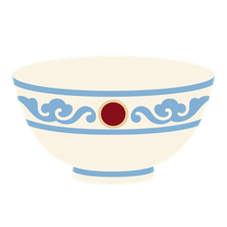
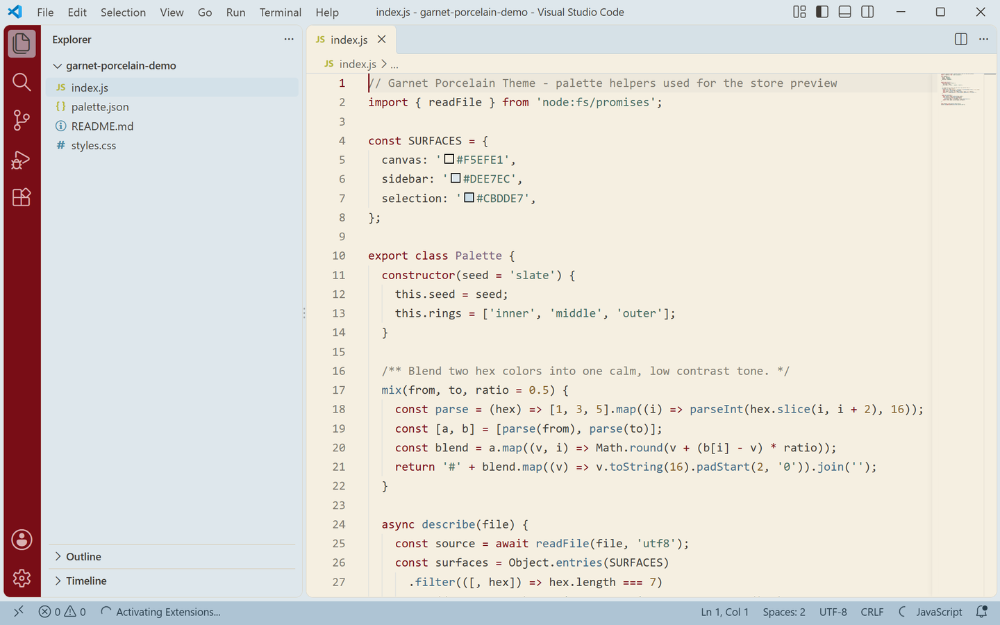
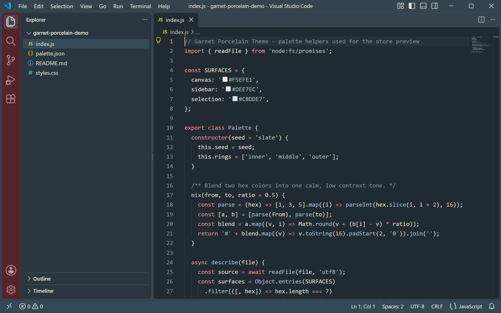

<p align="center">
  
</p>

<h1 align="center">Garnet Porcelain Theme</h1>

<p align="center">
  <a href="https://marketplace.visualstudio.com/items?itemName=lilin.garnet-porcelain-theme"></a>
  
  
  <a href="https://github.com/vaxicy/garnet-porcelain-theme/blob/main/LICENSE"></a>
</p>

A porcelain-inspired editor theme built around **garnet red**, **dusty blue**, **warm ivory** and **pale gold**. The light variant reads like glazed ceramic, the dark variant like deep indigo porcelain — both share one palette, so the workspace keeps its identity when you switch.

以**石榴红、雾霾蓝、暖象牙色与淡金**为核心的一套瓷器感主题：浅色如釉面瓷，深色如靛青瓷；两套变体共享同一色板，明暗切换时风格保持一致。

## Preview / 预览

| Light 浅色 | Dark 深色 |
| --- | --- |
|  |  |

> Both previews are captured from a real VS Code window running the theme — no mockups.
>
> 上方预览图取自真实运行该主题的 VS Code 窗口截图，非模拟图。

## Palette / 色板

| Role | Light | Dark |
| --- | --- | --- |
| Editor background | `#F5EFE1` warm ivory | `#202A32` deep indigo |
| Foreground | `#403B36` warm charcoal | `#EDE6D9` porcelain white |
| Accent (focus / cursor) | `#790D16` garnet | `#E59A9F` porcelain rose |
| Selection | `#CBDDE7` dusty blue | `#405868` slate blue |
| Current line | `#EDE8DC` | `#25323B` |
| Side bar / panels | `#DEE7EC` | `#293640` |
| Title bar | `#DEE7EC` | `#34434E` |
| Status bar | `#AEC4D4` on `#263B49` | `#344956` on `#EDE6D9` |
| Activity bar | `#790D16` on `#F5EFE1` | `#56232B` on `#F5EFE1` |
| Borders / indent guides | `#C8D3D9` | `#46535D` |
| Button | `#790D16` on `#F5EFE1` | `#E5D3AF` on `#56232B` |
| Badge | `#F5EFE1` on `#790D16` | `#E5D3AF` on `#56232B` |

## Syntax mapping / 语法映射

| Syntax | Light | Dark |
| --- | --- | --- |
| Comments | `#817B71` | `#89959D` |
| Keywords / storage / tags | `#790D16` garnet | `#E59A9F` porcelain rose |
| Strings | `#476C63` jade | `#A9C8B5` jade |
| Numbers / constants | `#86632D` ochre | `#E5D3AF` pale gold |
| Types / classes | `#79627E` plum | `#C6B5CE` lilac |
| Functions / methods | `#426A86` dusty blue | `#AEC4D4` dusty blue |
| Attributes | `#86632D` | `#EAC18C` |
| Variables | `#403B36` | `#EDE6D9` |

Both variants are built from the same roles, so switching between them changes the light level rather than the identity.

两套变体的角色色一一对应，切换时改变的是明暗而非风格。

## Coverage / 覆盖范围

Every surface below is themed in both variants:

- **Editor** — background, foreground, selection and inactive selection, current-line highlight, find matches and highlights, bracket-match color and border, cursor, line numbers, indent guides, whitespace, errors, warnings and info.
- **Workbench chrome** — activity bar, title bar (active and inactive), side bar, status bar (including the no-folder and debugging states), editor group header and tabs.
- **Panels and overlays** — side panel, editor widgets, hover widget, suggest widget, dropdowns, inputs and placeholder text, notifications, quick input, and the focus border.
- **Lists** — active, inactive and hover selection backgrounds, plus highlight color.
- **Terminal** — background, foreground and the full ANSI palette, matched to the theme.
- **Details** — all workbench borders, scrollbar sliders, git decoration colors, and semantic token colors for function, method, class, type, string, number, keyword and comment.

以下区域在两套变体中均已配色：编辑器本体（选区、当前行、查找匹配、括号匹配、光标、行号、缩进线、空白符、错误/警告/提示）、活动栏与标题栏、侧边栏、状态栏、标签栏、面板与各类浮窗（悬停、建议、通知、快速输入）、下拉与输入框、列表选中/悬停、全部边框与滚动条、Git 装饰色、终端 ANSI 全色，以及函数/方法/类/类型/字符串/数字/关键字/注释的语义高亮。

## Features / 功能

- **Two coordinated variants** — `Garnet Porcelain Theme Light` and `Garnet Porcelain Theme Dark` ship in one extension.
- **Porcelain palette** — garnet red, dusty blue, warm ivory and pale gold, applied consistently across the whole workbench.
- **Semantic highlighting** enabled, so language-aware tokens are colored beyond the classic TextMate scopes.
- **Terminal ANSI colors** taken from the same palette, so the integrated terminal sits inside the theme.
- **Readable contrast** — garnet and charcoal on ivory, porcelain white on deep indigo, tuned for long sessions.

- **明暗两套协调变体**——同一扩展内含 `Garnet Porcelain Theme Light` 与 `Garnet Porcelain Theme Dark`。
- **瓷器色板**——石榴红、雾霾蓝、暖象牙色与淡金，贯穿整个工作台界面。
- **启用语义高亮**，在传统 TextMate scope 之外为语言感知的 token 着色。
- **终端 ANSI 配色**取自同一色板，集成终端与主题融为一体。
- **对比度友好**——象牙底上的石榴红与暖炭灰、靛青底上的瓷白，适合长时间阅读与编码。

## Installation / 安装

Requires VS Code 1.80 or newer.

1. Search for **Garnet Porcelain Theme** in the Extensions view (`Ctrl+Shift+X`), or open the [Marketplace page](https://marketplace.visualstudio.com/items?itemName=lilin.garnet-porcelain-theme).
2. Or install from a VSIX: download `garnet-porcelain-theme-1.0.0.vsix`, open the Command Palette (`Ctrl+Shift+P` / `Cmd+Shift+P`) and run **Extensions: Install from VSIX...**.

需要 VS Code 1.80 或更高版本。

1. 在扩展面板（`Ctrl+Shift+X`）搜索 **Garnet Porcelain Theme**，或打开 [Marketplace 页面](https://marketplace.visualstudio.com/items?itemName=lilin.garnet-porcelain-theme)。
2. 也可以从 VSIX 安装：下载 `garnet-porcelain-theme-1.0.0.vsix`，打开命令面板（`Ctrl+Shift+P` / `Cmd+Shift+P`），运行 **Extensions: Install from VSIX...** 并选择该文件。

Or from the command line:

或使用命令行：

```
ext install lilin.garnet-porcelain-theme
```

## Activation / 启用

Open the Command Palette (`Ctrl+Shift+P` / `Cmd+Shift+P`), run **Preferences: Color Theme**, and choose **Garnet Porcelain Theme Light** or **Garnet Porcelain Theme Dark**.

To switch between the two variants quickly, use the keyboard shortcut `Ctrl+K Ctrl+T` at any time.

打开命令面板（`Ctrl+Shift+P` / `Cmd+Shift+P`），运行 **Preferences: Color Theme**，选择 **Garnet Porcelain Theme Light** 或 **Garnet Porcelain Theme Dark**。

随时可用快捷键 `Ctrl+K Ctrl+T` 在两套变体之间快速切换。

## Development / 开发

Open this folder in VS Code and press `F5` to launch an Extension Development Host with the theme loaded. Regenerate the real-window preview screenshots with:

在 VS Code 中打开本文件夹并按 `F5`，在扩展开发宿主中预览主题。重新生成真实窗口预览图：

```bash
python3 scripts/capture-real-screenshots.py
```

## License / 许可

Released under the **Non-Commercial License** — licensed for personal, educational and non-commercial use. See [LICENSE](LICENSE) for details.

基于 **Non-Commercial License（非商业使用许可）** 发布，可用于个人、教育及非商业用途，详见 [LICENSE](LICENSE)。

## Feedback / 反馈

Found an unthemed area or want a tweak? Open an issue at [github.com/vaxicy/garnet-porcelain-theme/issues](https://github.com/vaxicy/garnet-porcelain-theme/issues).

发现没有配色的区域或想调整某处颜色，欢迎在 [GitHub Issues](https://github.com/vaxicy/garnet-porcelain-theme/issues) 反馈。

## Publisher / 发布者

Published by **lilin** on the Visual Studio Code Marketplace.
